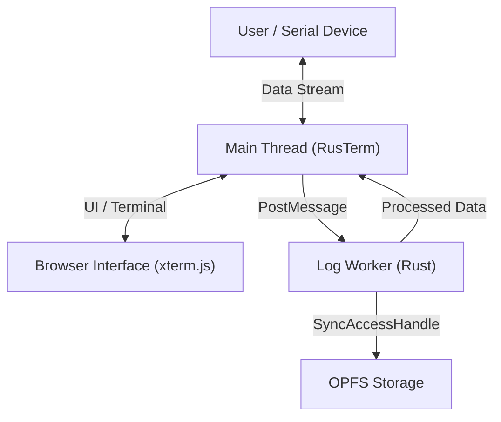

# 📡 RusTerm (Built with Rust & Dioxus)


A high-performance, browser-based Serial Monitor & Terminal that requires **no installation**. Built with **Rust (Dioxus)** and **WebAssembly**, it provides a desktop-class experience directly in your browser.

Unlike typical web serial tools, RusTerm leverages **OPFS (Origin Private File System)** and **Web Workers** to handle **Gigabyte-scale logs** without freezing the UI, featuring real-time filtering, virtual scrolling, and a full-featured terminal.

[**🔴 RusTerm Live**](https://imwoo90.github.io/web_serial_monitor/)

---

## ✨ Key Features

### 🚀 Performance & Core
*   **Web Serial API**: Connect to COM ports / TTY devices directly from Chrome/Edge. No drivers or software installation needed.
*   **High-Performance Logging**: Handles **millions of log lines** seamlessly using **OPFS** (Persistent Storage) and asynchronous stream processing.
*   **Zero-Lag UI**: Implements **Virtual Scrolling** to render only visible items, keeping memory usage low even with massive datasets.
*   **Non-Blocking Filter**: Background worker handles search/filtering efficiently using a **Progressive Scan & Yield** algorithm.

### 💻 Terminal & Interaction
*   **Terminal Mode (xterm.js)**: A full-featured interactive terminal with ANSI/VT100 support.
*   **Bidirectional Communication**: Send commands and receive responses in real-time.
*   **Smart Auto-Scroll**: Tracks the bottom reliably even during high-speed data ingestion.
*   **Configurable Layout**: Interactive font resizing and window fitting for the terminal instance.

### 🛠️ Advanced Tools
*   **Real-time Filtering**: Filter logs by text, case-sensitivity, or **RegEx**. Supports **Invert Log** logic.
*   **Smart Highlighting**: Assign custom colors to specific keywords (e.g., "Error" -> Red, "Warning" -> Yellow).
*   **Hex View Mode**: Inspect raw binary data in Hexadecimal format.
*   **Log Export**: Download full session logs (GBs) as a file instantly without memory crashes using **Stream API**.

---

## ⚡ Performance & Real-world Testing

RusTerm is engineered for industrial-grade debugging where data volume is high and UI responsiveness is critical.

*   **ESP32-C3 USB CDC Stable**: Handles maximum through-put from native USB devices (which bypasses physical UART baud rate limits) with zero frame drops.
*   **Constant-Time UI**: Whether you have 100 lines or **10,000,000 lines**, the UI responsiveness and virtual scrolling performance remain identical (O(1) complexity).
*   **Concurrent Worker Processing**: All log ingestion, VT100 parsing, and filtering happen in a background Rust worker. The main UI thread stays 100% responsive for interaction even during intense data floods.
*   **Browser-Native Speed**: Leverages **WASM** and **OPFS** to achieve speeds that traditional JavaScript-based serial tools cannot reach.


---

## 🏗️ Architecture

RusTerm uses a multi-threaded architecture to ensure a smooth UI even under heavy I/O load.

*   **Main Thread (Rust/Dioxus)**: Manages UI, state, and serial port communication.
*   **Web Worker (Rust)**:
    *   **OPFS**: Persistent storage for massive logs.
    *   **VT100 Parser**: Robust processing of ANSI escape sequences.
    *   **Search Engine**: Efficient log filtering and scanning.
*   **Terminal (xterm.js)**: High-performance terminal rendering and keyboard input handling.



---

## 📦 Getting Started

### Prerequisites
*   **Rust**: Stable toolchain installed.
*   **Dioxus CLI**: `cargo install dioxus-cli`
*   **Wasm32 Target**: `rustup target add wasm32-unknown-unknown`

### Running Locally
```bash
# 1. Clone the repository
git clone https://github.com/imwoo90/web_serial_monitor.git
cd web_serial_monitor

# 2. Run with Dioxus CLI
dx serve --port 8080
```
Open `http://localhost:8080` in a supported browser.

---

## 📖 Usage Guide

1.  **Connect**: Click **Connect** and select your device. Set the appropriate Baud Rate.
2.  **Mode Switch**:
    *   **Monitor**: Optimized for high-speed logging.
        *   **Filter**: Use the search bar for instant log filtering.
        *   **Highlight**: Open the highlighter panel to color-code specific log patterns.
    *   **Terminal**: Use for interactive shells and command-line interfaces.
3.  **Export**: Download logs using the export icon in the header.

---

## ⚠️ Browser Compatibility
*   **Required**: Browsers supporting **Web Serial API** and **OPFS**.
    *   ✅ Google Chrome (89+)
    *   ✅ Microsoft Edge (89+)
    *   ✅ Opera
    *   ❌ Firefox / Safari (Not supported yet)

---

## 📜 License
This project is licensed under the **Apache License 2.0**.

